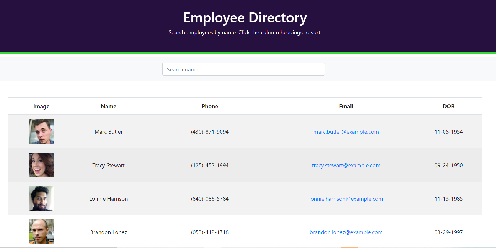

# Employee Directory React App
## The App
This App  was developed using React. It is intended to allow an employer to search his employee list using a Random User API. It can search by name and sort details with 'a click of the column'.
##Installation
No installation necessary, simply view it on Github at: https://drewbassett24.github.io/employee-directory/

##Screenshot


##Software/technology
Javascript and React. Created via Node.

##Summary
I found this pretty hard and made a lot of use of online support, such as tutorials, etc. I also had to start again at one point, so I'm not sure all my commits are reflected. In addition, deploying a React App was tricky. Which is something I'd really like to improve on, as it should be quick and easy. Apparently...